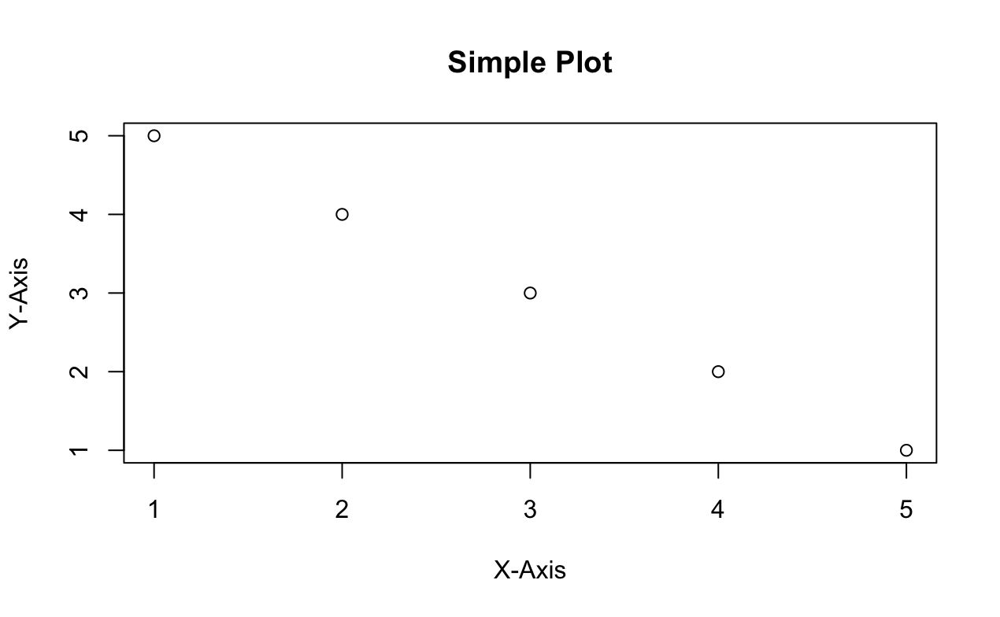

# Github-tutorial

## Introduction
In this repository, we use the R programming language to create a simple scatter plot. The grammar you used here is basically just the one for Markdown, which you just learned for Quarto. You can search Google for any specific expression you need.

## Data
|    Y    |    X    |
| ------- | ------- |
|    5    |    1    |
|    4    |    2    |
|    3    |    3    |
|    2    |    4    |
|    1    |    5    |

## Plot

## Contact
If there are any questions, contact XXXXX@psu.edu
